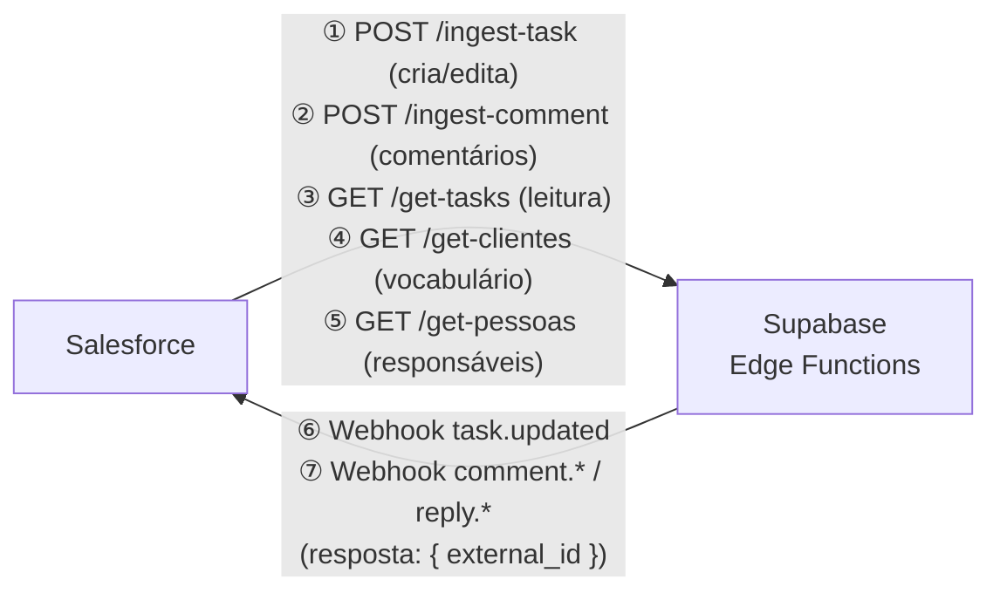
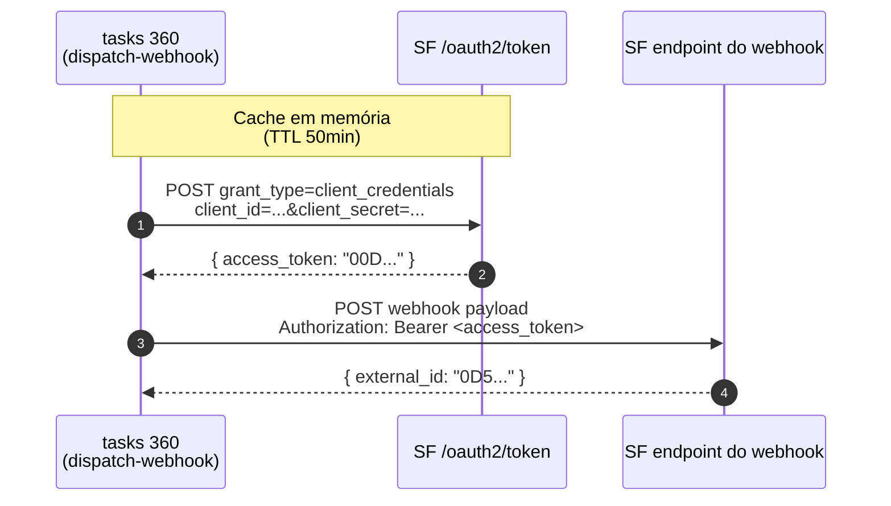

# Integração Salesforce ↔ tasks 360 (Kliente 360)

> Documentação técnica para o dev Salesforce. Última atualização: 24/05/2026 · v1.02.193.

## Visão geral da arquitetura



Toda comunicação passa por **Edge Functions** hospedadas em Supabase. **Não há acesso direto ao banco** — clientes externos sempre passam por uma das funções.

- **Base URL**: `https://<project-ref>.supabase.co/functions/v1`
- **Autenticação**: header `X-API-Key: <token>` (token compartilhado entre todas as funções de ingestão e leitura)
- **Content-Type**: `application/json`

---

## Autenticação

Para chamadas **Salesforce → app**:
- Header obrigatório: `X-API-Key: <seu token>`
- O token vive em `INGEST_API_KEYS` (lista CSV) na configuração das Edge Functions. Solicite ao admin do tasks 360.
- Resposta `401 unauthorized` se ausente ou inválido.

Para webhooks **app → Salesforce**:
- Você expõe 2 endpoints públicos (1 para task, 1 para comment).
- O app envia `Authorization: Bearer <secret>` se configurado. O `<secret>` é definido no env var `DISPATCH_WEBHOOK_SECRET` do nosso lado; combine o valor conosco.

---

## 1. Identificação de tasks e comments

Toda task ou comment criado no SF e ingerido aqui carrega 2 ids:

| Campo               | Quem gera | Para que serve |
|---------------------|-----------|----------------|
| `id` (UUID)         | tasks 360 | identidade interna |
| `external_id` (text)| SF        | dedupe + link bidirecional |
| `external_source`   | constante | sempre `"salesforce"` para vínculos seus |

Use **`external_id`** como chave estável em todos os endpoints. O UUID interno aparece nos payloads de webhook (`task_id`, `comment_id`) para você logar/correlacionar, mas o seu sistema deve usar `external_id` como chave primária para lookups.

---

## 2. Endpoints inbound (Salesforce → tasks 360)

### 2.1 `POST /ingest-task`

Cria ou atualiza uma task identificada por `external_id`. **Upsert idempotente** — chame quantas vezes quiser com o mesmo `external_id`; só campos enviados são atualizados.

**Headers**: `X-API-Key`, `Content-Type: application/json`

**Body**:
```json
{
  "external_id":     "a01XX0000004ABC",
  "titulo":          "Customizar layout do Account",
  "descricao":       "Cliente pediu Lightning record page específico",
  "cliente":         "Bodytech",
  "projeto":         "Sustentação BT",
  "responsavel_id":  "b2f4e891-3c1a-4d7e-9f02-a5c8d6b1e034",
  "prioridade":      "P1",
  "esforco":         4,
  "prazo":           "2026-06-15",
  "subetapa":        "em_desenvolvimento",
  "complexidade":    "media",
  "tipo_trabalho":   "feature",
  "tags":            ["frontend", "lightning"],
  "criado_por_ia":   false,
  "external_status": "Em andamento",
  "solucao_implementada": "Layout customizado com Lightning Record Page, deployado em sandbox X"
}
```

| Campo | Tipo | Obrigatório | Notas |
|---|---|---|---|
| `external_id` | string | **sim** | Record Id do custom object no SF |
| `titulo` | string | **sim** no create | até 255 chars |
| `descricao` | string | não | markdown ok · **pedido/escopo** da task |
| `solucao_implementada` | string | não | **entrega** da task · usado pelo IA-summary pra gerar narrativa pedido→entrega · normalmente preenchido quando subetapa ≥ em_homologacao |
| `cliente` | string | não | **resolução por nome** case-insensitive. `null`/`""`/`"Triagem"` = task sem cliente |
| `projeto` | string | não | resolução por nome dentro do cliente. Ignorado se `cliente` for null |
| `responsavel_id` | string (UUID) | não | **preferencial** — UUID direto da pessoa (obtido via `GET /get-pessoas`). Sem lookup. Tem precedência sobre `responsavel`. |
| `responsavel` | string | não | alternativa: resolução por nome case-insensitive. Ignorado se `responsavel_id` for enviado. `"Triagem"` = sem responsável. |
| `prioridade` | enum | não | `P0` \| `P1` \| `P2` \| `P3` |
| `esforco` | number | não | horas (decimal aceito) |
| `prazo` | string | não | `YYYY-MM-DD` |
| `subetapa` | enum | não | ver §3.1 |
| `status` | enum | não | **legado** — preferir `subetapa`. `backlog` \| `andamento` \| `bloqueado` \| `concluido` |
| `complexidade` | enum | não | `alta` \| `media` \| `baixa` |
| `tipo_trabalho` | enum | não | `bug` \| `feature` \| `discovery` \| `manutencao` \| `admin` |
| `tags` | string[] | não | tags livres |
| `criado_por_ia` | boolean | não | true se a task foi gerada por automação SF |
| `external_status` | string | não | **sinal de cancelamento**. Ver §2.1.1 |

**Resposta**:
- `201 Created` (insert): `{ "id": "<uuid>", "action": "created", "responsavel_id": "<uuid>|null" }`
- `200 OK` (update): `{ "id": "<uuid>", "action": "updated", "responsavel_id": "<uuid>|null" }`
- `200 OK` (cancel): `{ "id": "<uuid>", "action": "archived", "responsavel_id": "<uuid>|null" }`
- `200 OK` (uncancel): `{ "id": "<uuid>", "action": "unarchived", "responsavel_id": "<uuid>|null" }`

`responsavel_id` na resposta é o UUID resolvido — confirma quem ficou como responsável (ou `null` se não enviado).

**Erros**:
- `401 unauthorized` — API key inválida
- `409 cliente_blocks_ai_ingest` — `criado_por_ia=true` + cliente com `webhook_enabled=true` (ex: VB, CTF). Tasks desses clientes devem vir pelo fluxo SF→ingest, não pelo Cowork/IA (anti-duplicação). Detalhes em §2.1.2.
- `422 invalid_<campo>` — validação de tipo/enum
- `422 cliente_not_found` / `projeto_not_found` / `responsavel_not_found` — nome não bate (só ao usar `responsavel` por nome)
- `500 db_error` — erro inesperado

#### 2.1.1 Cancelamento / reabertura via `external_status`

O campo `external_status` é **opcional** e age como sinal semântico:

| Valor enviado | Comportamento |
|---|---|
| `"Cancelado"` (case-insensitive) | Força `subetapa='bloqueado'` + `arquivado_em=now`. Posta auto-comment interno **"CANCELADO no sistema externo — task arquivada automaticamente."**. Idempotente: re-cancelar não duplica. |
| Qualquer outro valor com task atualmente arquivada | Desarquiva (`arquivado_em=null`), aplica `subetapa` enviada normalmente. Posta auto-comment **"Desarquivada — saiu de CANCELADO no sistema externo."**. |
| Ausente (campo não enviado) e task arquivada | Desarquiva silenciosamente (comportamento legado preservado), **sem** auto-comment. |
| Outros casos | Sem efeito especial. |

**Recomendação**: sempre que houver mudança de status que reflita cancelamento (Closed Lost, Cancelled, etc.), envie `external_status: "Cancelado"`. Para reabertura, envie o novo status (ex: `"Em andamento"`) junto com o `subetapa` apropriado.

#### 2.1.2 Anti-duplicação · `webhook_enabled` bloqueia ingest IA

Clientes com **integração SF bidirecional** (`clientes.webhook_enabled=true` — hoje **VB** e **CTF**) **não recebem ingest via IA** (Cowork, Apps Script etc.). A regra existe pra evitar tasks duplicadas: como o próprio Salesforce já cria a task aqui via `ingest-task` com `external_id`, e mudanças bidirecionais fluem via webhook, qualquer ingest IA paralelo geraria ruído ou conflito.

**Quando dispara o gate:**
- Body do `ingest-task` contém `criado_por_ia: true`
- O cliente resolvido tem `webhook_enabled = true`

Resposta: `409 cliente_blocks_ai_ingest`.

**Detalhes técnicos:**
- O gate **só** dispara se o body trouxer `criado_por_ia=true`. Ingests normais do Salesforce (que não setam esse flag) passam pelo gate sem afetar.
- Os domínios cadastrados em VB/CTF (ex: `corpay.com.br`) são compartilhados entre os dois clientes — não daria pra distinguir só pelo email. `webhook_enabled` é o critério estável.
- Pra ativar/desativar pro cliente, basta toggle no banco: `update clientes set webhook_enabled = <bool> where nome = '...'`.

**Recomendação pro lado do AppScript/Cowork:** opcionalmente, pular emails dos domínios bloqueados antes de chamar `ingest-task` (economiza chamada API que retornaria 409). O servidor protege em qualquer caso.

---

### 2.2 `POST /ingest-comment`

Recebe um post ou reply do Chatter e prende numa task aqui. Idempotente por `external_id`.

**Body**:
```json
{
  "external_id":        "0D5XX0000001ABC",
  "task_external_id":   "a01XX0000004ABC",
  "parent_external_id": "0D5XX0000000XYZ",
  "author":             "Maria Silva",
  "author_external_id": "005XX000000001",
  "body":               "Cliente confirmou no email de hoje.",
  "posted_em":          "2026-05-22T14:30:00Z"
}
```

| Campo | Tipo | Obrigatório | Notas |
|---|---|---|---|
| `external_id` | string | **sim** | FeedItem.Id do post original |
| `task_external_id` | string | **sim** | Record Id da task pai no SF |
| `parent_external_id` | string | não | FeedItem.Id do comment pai. **Define que é reply.** |
| `author` | string | **sim** | nome do autor (CreatedBy.Name) |
| `author_external_id` | string | não | UserId do SF |
| `body` | string | **sim** | texto do post |
| `posted_em` | string | não | ISO 8601. Default = `now` |

**Regras**:
- Aninhamento máximo: **1 nível** (replies de replies são proibidas pelo DB; o insert falha com `replies cannot have replies (max 1 level of nesting)`).
- O comment ingerido fica marcado como `from_cliente=false` por padrão.
- Auto-comments do sistema (cancelamento/desarquivamento) são marcados com `author="Salesforce"` e `visivel_cliente=false` (não vão para o Portal cliente).

**Resposta**:
- `201` (criado) / `200` (atualizado): `{ "id": "<uuid>", "action": "created"|"updated" }`

---

## 3. Endpoints de leitura (Salesforce ← tasks 360)

### 3.1 `GET /get-tasks`

Lista tasks com filtros.

**Query params** (todos opcionais):

| Param | Tipo | Notas |
|---|---|---|
| `pessoa` | UUID ou nome | filtra por responsável. Aceita email também. |
| `status` | CSV de enums | `backlog,andamento,bloqueado,concluido`. Default: **exclui** `concluido`. |
| `include_concluido` | `true` | inclui concluídas (ignora default acima) |
| `prazo_de` / `prazo_ate` | `YYYY-MM-DD` | janela de prazo |
| `cliente_id` | UUID | |
| `projeto_id` | UUID | |
| `limit` | número | default 100, máx 200 |

**Resposta**:
```json
{
  "tasks": [
    {
      "id": "<uuid>",
      "external_id": "a01XX0000004ABC",
      "titulo": "...",
      "status": "andamento",
      "subetapa": "em_desenvolvimento",
      "prazo": "2026-06-15",
      "esforco": 4,
      "prioridade": "P1",
      "tags": ["frontend"],
      "atrasada": false,
      "criado_por_ia": false,
      "criado_em": "2026-05-01T10:00:00Z",
      "cliente": "Bodytech",
      "cliente_id": "<uuid>",
      "projeto": "Sustentação BT",
      "projeto_id": "<uuid>",
      "responsavel": "Jéssica Santos",
      "pessoa_id": "<uuid>"
    }
  ],
  "total": 12
}
```

#### Enum `subetapa` (com mapeamento para `status` macro)

| Subetapa | Macro (status) | Notas |
|---|---|---|
| `backlog` | `backlog` | sem priorização |
| `priorizado` | `backlog` | priorizado mas ainda não iniciado |
| `em_definicao` | `backlog` | refinamento |
| `escopo_definido` | `backlog` | pronto pra começar |
| `em_desenvolvimento` | `andamento` | executando |
| `em_homologacao` | `andamento` | aguardando teste |
| `em_revisao` | `andamento` | em PR/code review |
| `pronto_producao` | `andamento` | aguardando deploy |
| `em_implantacao` | `andamento` | deploy em curso |
| `bloqueado` | `bloqueado` | usado também em cancelamento (com `arquivado_em` setado) |
| `concluido` | `concluido` | feito |

---

### 3.2 `GET /get-clientes`

Lista clientes para descobrir vocabulário antes de chamar `ingest-task`.

**Query params**:
- `?include_archived=true` — inclui arquivados (default exclui)
- `?include_interno=true` — inclui buckets internos (default exclui)
- `?with_projetos=true` — anexa lista de projetos ativos

**Resposta**:
```json
{
  "clientes": [
    {
      "id": "<uuid>",
      "nome": "Bodytech",
      "tier": "estrategico",
      "eh_interno": false,
      "dominios": ["bodytech.com.br"],
      "projetos": [
        { "id": "<uuid>", "nome": "Sustentação BT", "tipo": "sustentacao" }
      ]
    }
  ]
}
```

`dominios` é útil para reconhecer cliente por email quando o nome é acrônimo.

---

### 3.3 `GET /get-pessoas`

Lista pessoas (responsáveis) e sua carga atual.

**Query params**:
- `?include_clientes=true` — inclui pessoas com `role='cliente'` (default exclui)
- `?role=admin,interno` — filtra por roles CSV
- `?cliente_id=<uuid>` — só pessoas alocadas no cliente
- `?with_load=true` — anexa `{ tasks_ativas, horas_pendentes }`

**Resposta**:
```json
{
  "pessoas": [
    {
      "id": "<uuid>",
      "nome": "Jéssica Santos",
      "email": "jessica@kliente360.com",
      "role": "interno",
      "senioridade": "pleno",
      "capacidade_horas_semana": 30,
      "skills": ["frontend", "react"],
      "cliente_principal_id": "<uuid>",
      "cliente_secundario_id": null,
      "tasks_ativas": 8,
      "horas_pendentes": 24
    }
  ]
}
```

---

## 4. Webhooks outbound (tasks 360 → Salesforce)

Quando uma task ou comment vinculado ao SF (`external_source='salesforce' AND external_id IS NOT NULL`) é alterado **dentro do nosso app**, disparamos um webhook para o seu endpoint. Você expõe 2 URLs:

- `WEBHOOK_URL_TASK` — recebe `task.updated`
- `WEBHOOK_URL_COMMENT` — recebe `comment.created`, `comment.updated`, `reply.created`, `reply.updated`

### Autenticação · OAuth 2.0 Client Credentials

Não enviamos `client_id`/`client_secret` direto no header do webhook. Seguimos o flow padrão do SF:



**O que você precisa nos passar** (5 itens por cliente — 10 envs no total pra VB + CTF):

| Item | Exemplo | Env do nosso lado |
|---|---|---|
| Token URL | `https://sempararempresas--homol.sandbox.my.salesforce.com/services/oauth2/token` | `WEBHOOK_TOKEN_URL_<VB\|CTF>` |
| Consumer Key (client_id) | `3MVG9...` | `WEBHOOK_CLIENT_ID_<VB\|CTF>` |
| Consumer Secret (client_secret) | `1234...` | `WEBHOOK_CLIENT_SECRET_<VB\|CTF>` |
| Webhook URL (task) | `.../services/apexrest/tasks360/task` | `WEBHOOK_URL_TASK_<VB\|CTF>` |
| Webhook URL (comment) | `.../services/apexrest/tasks360/comment` | `WEBHOOK_URL_COMMENT_<VB\|CTF>` |

**Headers que você recebe em cada webhook** (passo 3 do diagrama):

| Header | Valor |
|---|---|
| `Content-Type` | `application/json` |
| `Authorization` | `Bearer <access_token>` |

**Como escolhemos o conjunto de credenciais**: olhamos `cliente.nome` da task que disparou o webhook. Match case-insensitive — contém `vb` → conjunto VB; contém `ctf` → conjunto CTF. Se a task não bater nenhum (cenário improvável — só esses dois têm `webhook_enabled=true` hoje), pulamos o disparo e marcamos `webhook_sync_status='error'` no banco com a mensagem `no credentials configured for cliente`.

**Cache de token**: guardamos o `access_token` em memória por **50min** (sessão SF default é 1h). Se receber `401` do seu lado, refazemos o token forçado e retentamos a chamada **uma vez** — não há retry exponencial.

### 4.1 Payload `task.updated`

`POST` no `WEBHOOK_URL_TASK`:

```json
{
  "sent_at": "2026-05-22T17:30:00Z",
  "task_id": "<uuid local>",
  "data": {
    "task_external_id": "a01XX0000004ABC",
    "record": {
      "titulo": "Customizar layout",
      "descricao": "...",
      "responsavel": "Jéssica Santos",
      "responsavel_id": "b2f4e891-3c1a-4d7e-9f02-a5c8d6b1e034",
      "prioridade": "P1",
      "prazo": "2026-06-15",
      "subetapa": "em_desenvolvimento"
    }
  }
}
```

**Campos**:
- `sent_at` — ISO timestamp do disparo
- `task_id` — UUID interno (use só pra logging)
- `data.task_external_id` — Record Id do SF; **chave de lookup do seu lado**
- `data.record.responsavel` — nome textual da pessoa atribuída (ou `null` se sem responsável)
- `data.record.responsavel_id` — UUID interno da pessoa (ou `null`). Use este campo para lookups no SF — é mais confiável que o nome.
- `data.record.subetapa` — ver enum em §3.1

### 4.2 Payload `comment.* / reply.*`

`POST` no `WEBHOOK_URL_COMMENT`:

```json
{
  "sent_at": "2026-05-22T17:30:00Z",
  "comment_id": "<uuid local>",
  "is_reply": false,
  "data": {
    "task_external_id": "a01XX0000004ABC",
    "comment_external_id": null,
    "parent_external_id": null,
    "record": {
      "body": "texto do comment ou reply"
    }
  }
}
```

**Disambiguação sem `event`**:

| Caso | `is_reply` | `comment_external_id` | `parent_external_id` |
|---|---|---|---|
| `comment.created` | `false` | `null` | `null` |
| `comment.updated` | `false` | `"0D5..."` | `null` |
| `reply.created` | `true` | `null` | `"0D5..."` ou `null`* |
| `reply.updated` | `true` | `"0D5..."` | `"0D5..."` |

**\*Race window**: o `parent_external_id` pode chegar `null` se a reply foi criada segundos depois do comment pai e o write-back do FeedItem.Id do pai ainda não voltou. Recomendo retry/queue do seu lado (poll do nosso `get-tasks` ou tentar novamente em 10-30s).

### 4.3 Response esperado dos webhooks

Para **AMBOS** os webhooks, responda com `200` ou `201` e body JSON:

```json
{ "external_id": "0D5XX0000001ABC" }
```

| Cenário | Como respondemos |
|---|---|
| Você devolve `external_id` num campo top-level | Persistimos em `tasks.external_id` ou `task_comments.external_id`. Marcamos `webhook_sync_status='synced'`. |
| Você devolve `200/201` sem `external_id` | Marcamos como `synced` sem atualizar id (use se o id já existia). |
| Você devolve `4xx`/`5xx` ou timeout (10s) | Marcamos `webhook_sync_status='error'` e gravamos a mensagem em `webhook_sync_error`. Aparece um chip "sync · erro" no modal da task para nossos admins. |

**Não faremos retry automático** — o operador do app pode acionar manualmente um update após você corrigir o problema.

### 4.4 Quando disparamos

| Evento | Quando dispara | Quando NÃO dispara |
|---|---|---|
| `task.updated` | Update da task no app por usuário interno | Update vindo do próprio `ingest-task` (anti-loop via `last_ingest_at`) ou update do `webhook_sync_status`/`external_id` (anti-loop) |
| `comment.created` | Usuário interno posta comment numa task SF | Comment vindo do `ingest-comment` ou auto-comments do sistema (anti-loop via `last_ingest_at` em INSERT) |
| `comment.updated` / `reply.updated` | Usuário edita comment | Idem |
| `reply.created` | Usuário interno responde comment | Idem |

### 4.5 Autosave OFF e clientes "webhook-enabled"

Para clientes flag-ados com `webhook_enabled=true` (ex: VB, CTF), nosso modal **desabilita o autosave** — o usuário precisa clicar explicitamente em "salvar" para que o webhook dispare. Isso evita avalanche de webhooks por cada keystroke.

---

## 5. Fluxos de exemplo

### 5.1 SF cria task → app reflete

```
SF (Apex trigger no after insert/update do Task__c)
  ↓
POST /ingest-task { external_id, titulo, cliente, responsavel_id, ... }
  ↓
tasks 360 cria/atualiza, retorna { id, action, responsavel_id }
```

### 5.2 Usuário edita task no app → SF reflete

```
Usuário interno edita task no modal do app
  ↓
UPDATE tasks (trigger anti-loop checa: NÃO veio de ingest)
  ↓
dispatch_webhook() → pg_net → Edge Function dispatch-webhook
  ↓
POST https://<sf-endpoint>/task com payload slim
  ↓
SF processa, retorna { external_id } (mesmo do request ou um novo)
  ↓
tasks 360 persiste external_id + webhook_sync_status='synced'
```

### 5.3 SF cancela task

```
SF (status field muda pra "Cancelled")
  ↓
POST /ingest-task { external_id, external_status: "Cancelado", ... }
  ↓
tasks 360: subetapa=bloqueado, arquivado_em=now, auto-comment criado
  ↓
Retorna { id, action: "archived" }
```

### 5.4 SF reabre task cancelada

```
SF (status volta pra "Em andamento")
  ↓
POST /ingest-task { external_id, external_status: "Em andamento",
                    subetapa: "em_desenvolvimento", ... }
  ↓
tasks 360: arquivado_em=null, subetapa aplicada, auto-comment criado
  ↓
Retorna { id, action: "unarchived" }
```

### 5.5 Comment SF → app

```
Usuário SF posta no Chatter de um Task__c
  ↓
SF (Platform Event ou trigger no FeedItem)
  ↓
POST /ingest-comment { external_id, task_external_id, author, body, ... }
  ↓
tasks 360 cria comment, aparece em realtime pra usuários internos
```

### 5.6 Reply app → SF

```
Usuário interno responde um comment SF no app
  ↓
INSERT task_comments com parent_id setado
  ↓
trigger dispara webhook 'reply.created' com parent_external_id
  ↓
POST <WEBHOOK_URL_COMMENT> { is_reply: true, parent_external_id, ... }
  ↓
SF cria FeedItem reply, retorna { external_id }
  ↓
tasks 360 persiste external_id no nosso comment
```

---

## 6. Anti-loop (importante)

Toda mudança de dados disparada por **sistema** (não por usuário) seta uma marca temporal `last_ingest_at`. Os triggers do banco detectam e suprimem o webhook de saída:

| Origem | `last_ingest_at` set? | Webhook dispara? |
|---|---|---|
| Usuário no app | não | ✅ sim |
| `ingest-task` (incluindo cancel/uncancel) | sim | ❌ não |
| `ingest-comment` | sim | ❌ não |
| Auto-comment do sistema (cancelado/desarquivado) | sim | ❌ não |
| `dispatch-webhook` atualizando `webhook_sync_status` ou `external_id` | n/a | ❌ não (guards específicos) |

Resultado: SF pode receber webhook → ingerir aqui → nosso trigger detecta e não devolve. Sem loop.

---

## 7. Identidade de erros

Resposta de erro padronizada:
```json
{
  "error": {
    "code":    "invalid_prioridade",
    "message": "prioridade deve ser P0|P1|P2|P3"
  }
}
```

| Código HTTP | Quando |
|---|---|
| `400` | JSON malformado, content-type errado |
| `401` | X-API-Key ausente ou inválida; Bearer secret errado |
| `405` | Método HTTP errado |
| `422` | Validação semântica (enum inválido, FK não encontrada) |
| `500` | Erro inesperado do banco — retentar |
| `502` | Webhook upstream timeout ou erro (só `dispatch-webhook`) |

---

## 8. Limites e quotas

- `get-tasks` retorna no máximo **200** registros por chamada. Para datasets maiores, paginar via filtros `prazo_de`/`prazo_ate` ou `cliente_id`.
- Timeout do webhook outbound: **10 segundos**. Se seu endpoint demorar mais, dispatch-webhook aborta e marca `synced=error`.
- `descricao`/`body` aceitam texto grande (sem limite hard codado), mas evite >50KB por mensagem.

---

## 9. Checklist de implementação no Salesforce

### Inbound (você envia pra nós)
- [ ] Trigger no `Task__c` (after insert/update) chama `/ingest-task` com payload v2.1.
- [ ] Mapear `Status__c='Cancelled'` → `external_status: "Cancelado"`. Outros valores: mandar `external_status: "<status atual>"` para auto-uncancel funcionar.
- [ ] Para `responsavel`: preferir `responsavel_id` (UUID direto via `GET /get-pessoas`) — mais robusto que lookup por nome. Fallback: `responsavel` por nome. Usar `"Triagem"` quando não souber.
- [ ] Trigger no `FeedItem` (after insert/update) com `ParentId` de um `Task__c` SF chama `/ingest-comment`. Setar `parent_external_id` quando for reply.

### Outbound (você recebe de nós)
- [ ] Expor endpoint `<SF_URL>/task` — POST JSON, valida `Authorization: Bearer <secret>`.
- [ ] Expor endpoint `<SF_URL>/comment` — POST JSON, valida secret.
- [ ] Ambos retornam `200` com `{ "external_id": "<id>" }`.
- [ ] Lidar com `parent_external_id: null` em `reply.created` (race window): retry ou enfileirar.

### Operação
- [ ] Combinar com o admin do tasks 360: `INGEST_API_KEYS` + `DISPATCH_WEBHOOK_SECRET` + `WEBHOOK_URL_TASK` + `WEBHOOK_URL_COMMENT`.
- [ ] Validar com um cliente piloto (VB ou CTF) antes de liberar para o resto.
- [ ] Monitorar `webhook_sync_status='error'` nas tasks — sinal de que o seu endpoint está retornando erro/timeout.

---

## 10. Contato

Qualquer dúvida de payload, código de erro novo ou comportamento estranho — abrir issue no repo `Kliente-360/tasks-360-mvp` ou falar direto com o admin do tasks 360. Source de verdade dos endpoints: `supabase/functions/<nome>/index.ts`.
